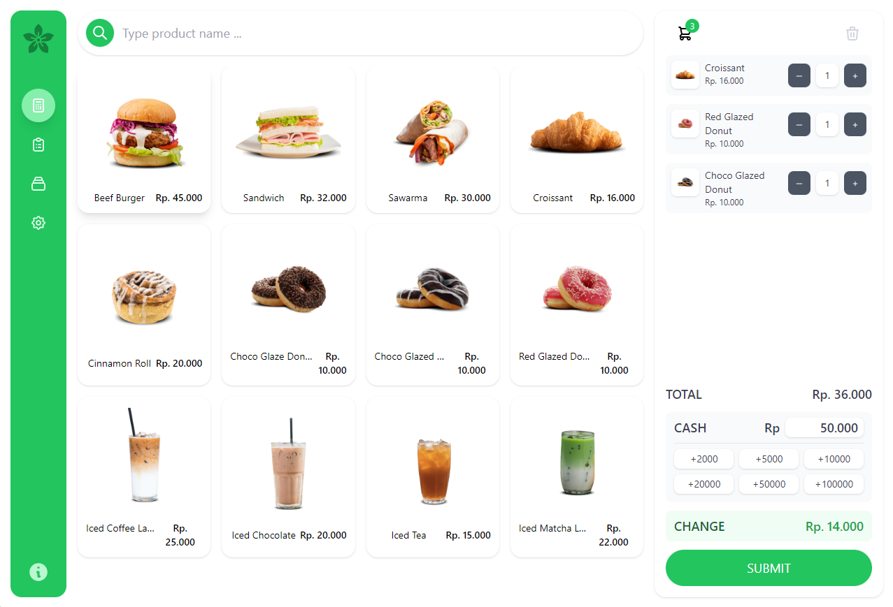

# Svelte + TS + Tailwind + Vite

Svelte Tailwind POS is a POS (Point of Sales) application built with Svelte and Tailwind.css, based on this reposiory: https://github.com/emsifa/tailwind-pos.
I used the refered repository "Tailwind POS" (all credits to the creators), as base as exercise to learn 'Svelte' and 'Tailwind css'.

## Recommended IDE Setup

[VS Code](https://code.visualstudio.com/) + [Svelte](https://marketplace.visualstudio.com/items?itemName=svelte.svelte-vscode).

## Need an official Svelte framework?

Check out [SvelteKit](https://github.com/sveltejs/kit#readme), which is also powered by Vite. Deploy anywhere with its serverless-first approach and adapt to various platforms, with out of the box support for TypeScript, SCSS, and Less, and easily-added support for mdsvex, GraphQL, PostCSS, Tailwind CSS, and more.
